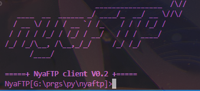

# Nyaftp V0.2 (Bubblepi) 🌸✨

Just a super kawaii version of an FTP program written in Python Nyaa~ 🐾



## Version 0.1 Features 🌈

1. Basic FTP commands included like `get`, `pull`, `ls`, `pwd`, `cd`, etc.

2. Added a loader that shows download speed & progress, making your FTP experience extra kawaii!

## Version 0.2 Features 🌟

1. Added more FTP console commands like `rm`, `mkdir`, etc. Expanding the kawaii functionalities!

2. Added a Cool Nyaftp Banner nya! Because every kawaii FTP deserves a cute banner.

3. Added support for directory management in the main console. Organizing files with a touch of kawaii!

4. Added support for local directory management in the FTP console. Making file transfers even more adorable!

### Nyaftp Requirements 🌸

This Nyaftp requires the following libraries to run. Make sure to install `colorama` and `tqdm` to experience maximum kawaii-ness! Nyaa~ 💖

```bash
pip install colorama tqdm
```

# Contributors 🌼

* Denizuh 🌈
